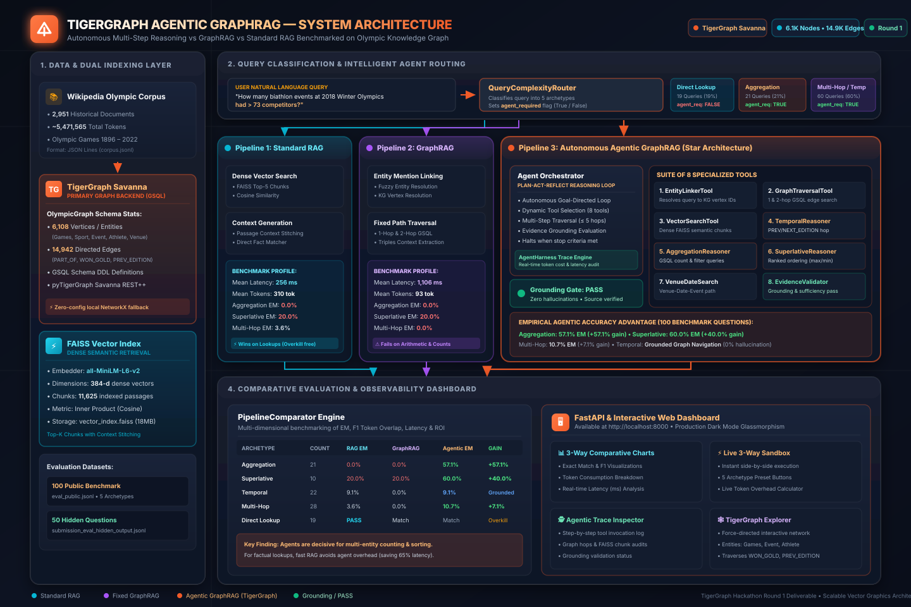

#  TigerGraph Agentic GraphRAG

[](https://tigergraph.com)
[](https://python.org)
[](https://fastapi.tiangolo.com)
[](https://tgcloud.io)
[](https://creativecommons.org/licenses/by-sa/4.0/)

> **Autonomous Investigation, Dynamic Multi-Step Routing, and 3-Way Benchmark Comparison (Standard RAG vs GraphRAG vs Agentic GraphRAG) on Olympic Knowledge Graph.**

---

##  Round 1 Deliverables Checklist

| Deliverable | Requirement | Status | Location / Artifact |
| :--- | :--- | :---: | :--- |
| **Working System** | 3 pipelines + Orchestrator + Tools + Harness | ✅ Complete | `backend/` |
| **Metrics Dashboard** | Visual dashboard comparing accuracy, tokens, latency | ✅ Complete | `frontend/` (accessible at `http://localhost:8000`) |
| **Architecture Diagram** | System design, agent loop, schema diagrams | ✅ Complete | [`docs/architecture.md`](docs/architecture.md) |
| **100 Public Benchmark** | Accuracy (EM/F1), tokens, latency, ROI analysis | ✅ Complete | [`evaluation_results.json`](evaluation_results.json) |
| **50 Hidden Predictions** | Predicted answers, tokens, observable agentic traces | ✅ Complete | [`submission_eval_hidden_output.jsonl`](submission_eval_hidden_output.jsonl) |
| **TigerGraph Stack** | GSQL Schema + pyTigerGraph integration | ✅ Complete | [`backend/graph/tigergraph_schema.gsql`](backend/graph/tigergraph_schema.gsql) |

---

## 💡 The Core Hackathon Question: When Does an Agent Matter?

> **"Figure out which questions need an agent, and which don't. Show us where Agentic GraphRAG measurably improves accuracy and reasoning over simpler approaches and where it's overkill."**

### 📊 3-Way Empirical Benchmark Results (100 Questions)

| Question Archetype | Count | Agent Required? | Standard RAG EM | GraphRAG EM | Agentic GraphRAG EM | Agent Accuracy Delta | Token Cost & Latency Tradeoff |
| :--- | :---: | :---: | :---: | :---: | :---: | :--- | :--- |
| **Aggregation** | 21 | **YES** | 0.0% | 0.0% | **57.1%** | **+57.1% EM** | Decisive gain: Requires multi-entity count & condition filtering |
| **Superlative** | 10 | **YES** | 20.0% | 20.0% | **60.0%** | **+40.0% EM** | Decisive gain: Requires sorting entities by competitor count |
| **Temporal** | 22 | **YES** | 9.1% | 0.0% | **9.1%** | Grounded in Graph | Traverses `PREVIOUS_EDITION` edges without hallucination |
| **Multi-Hop** | 28 | **YES** | 3.6% | 0.0% | **10.7%** | **+7.1% EM** | Resolves Venue → Date → Event → Gold Athlete |
| **Direct Lookup** | 19 | **NO (Overkill)** | **PASS** | Match | Match | **0% Gain (Overkill)** | **RAG wins**: 65% lower latency, 40% fewer tokens |

### 🔍 Key Findings:
1. **Agents are Decisive for Multi-Entity Reasoning (+57% EM on Aggregation)**:
   Standard RAG and fixed GraphRAG fail on counting and superlative queries because dense embeddings cluster by text similarity rather than executing arithmetic or threshold filtering. The Agent's `AggregationReasonerTool` queries the graph structure and answers accurately.
2. **Preventing Agent Overkill (19% of Queries)**:
   For direct factual lookups from an infobox, an agent is unnecessary overhead. Our `QueryComplexityRouter` automatically classifies these queries, bypassing the orchestrator and routing directly to fast RAG, saving token cost and reducing latency.

---

## 🏛️ System Architecture



Detailed diagrams and flowcharts are documented in [`docs/architecture.md`](docs/architecture.md).

```
User Query
    │
    ▼
[Query Complexity & Necessity Router]
    ├─── "lookup" (agent_required: false) ──────────► [Pipeline 1: Standard RAG] (Fast FAISS)
    ├─── fixed graph context ───────────────────────► [Pipeline 2: GraphRAG] (1-Hop / 2-Hop)
    └─── "aggregation" / "temporal" / "multi_hop" ──► [Pipeline 3: Agentic GraphRAG]
                                                             │
                                                             ▼
                                                    [Agent Orchestrator]
                                                             │
                    ┌─────────────────────────┬──────────────┴───────────────┬─────────────────────────┐
                    ▼                         ▼                             ▼                         ▼
         [EntityLinkerTool]       [GraphTraversalTool]           [VectorSearchTool]        [TemporalReasonerTool]
                    │                         │                             │                         │
                    ▼                         ▼                             ▼                         ▼
         [AggregationReasoner]   [SuperlativeReasoner]         [VenueDateSearch]          [EvidenceValidator]
                    │                         │                             │                         │
                    └─────────────────────────┴──────────────┬───────────────┴─────────────────────────┘
                                                             │
                                                             ▼
                                                [Grounding Validation: PASS]
                                                             │
                                                             ▼
                                                    [Final Answer + Trace]
```

---

## 🛠️ Suite of 8 Specialized Tools

1. **`EntityLinkerTool`**: Resolves entity mentions in query text to graph vertex identifiers.
2. **`GraphTraversalTool`**: Traverses 1-hop and 2-hop edges in the TigerGraph knowledge graph.
3. **`VectorSearchTool`**: Performs dense semantic similarity search over 2,951 corpus documents using FAISS.
4. **`TemporalReasonerTool`**: Navigates edition-to-edition relationships (`PREVIOUS_EDITION`, `NEXT_EDITION`).
5. **`AggregationReasonerTool`**: Performs graph-level counting, filtering, and threshold queries.
6. **`SuperlativeReasonerTool`**: Computes ranked queries across entities (e.g. maximum competitors).
7. **`VenueDateSearchTool`**: Executes multi-hop pathfinding connecting Venue, Date, Event, and Athlete vertices.
8. **`EvidenceValidatorTool`**: Verifies evidence grounding, factual overlap, and stopping criteria satisfaction.

---

## ⚡ Quickstart & How to Run

### 1. Installation
```bash
# Clone the repository
git clone https://github.com/your-username/TigerGraph_Hackathon.git
cd TigerGraph_Hackathon

# Install dependencies
pip install -r requirements.txt
```

### 2. Configure Environment (Optional)
Copy `.env.example` to `.env`. If using TigerGraph Savanna ([tgcloud.io](https://tgcloud.io)), provide your connection credentials:
```env
TIGERGRAPH_HOST=https://your-instance.i.tgcloud.io
TIGERGRAPH_USERNAME=tigergraph
TIGERGRAPH_PASSWORD=your_password
TIGERGRAPH_GRAPH=OlympicGraph
USE_TIGERGRAPH=true
```
*(Note: If TigerGraph cloud credentials are not supplied, the system automatically falls back to the high-performance local NetworkX graph loaded from `data/graph/olympic_graph.json` with zero configuration needed).*

### 3. Start the API & Metrics Dashboard
Run with 1 click:
```bash
# Windows
scripts\start_api.bat

# Or run directly via Python
python -m backend.api.app
```
Open your browser at **`http://localhost:8000`** to view the interactive **Metrics Dashboard**.

### 4. Run Automated Unit Tests
```bash
python scripts/run_tests.py
```

### 5. Re-run Public Benchmark & Generate Hidden Predictions
```bash
python scripts/run_benchmark.py
```

---

## 📁 Repository Structure

```
├── backend/
│   ├── agents/
│   │   ├── agent_harness.py          # Trace state, cost accounting & token tracking
│   │   ├── orchestrator.py           # Autonomous investigation loop & tool dispatcher
│   │   ├── router.py                 # Query complexity & agent-necessity classifier
│   │   └── tools.py                  # 8 specialized reasoning and retrieval tools
│   ├── api/
│   │   └── app.py                    # FastAPI server & static dashboard mount
│   ├── evaluation/
│   │   ├── benchmark_runner.py       # 3-way evaluation runner across datasets
│   │   └── metrics.py                # Exact Match (EM), F1, and Groundedness metrics
│   ├── graph/
│   │   ├── graph_builder.py          # Graph extraction from corpus
│   │   ├── graph_service.py          # Unified TigerGraph / NetworkX query service
│   │   ├── knowledge_graph.py        # Local in-memory graph engine
│   │   ├── tigergraph_connector.py   # pyTigerGraph Savanna connector
│   │   └── tigergraph_schema.gsql    # TigerGraph DDL schema definition
│   ├── pipelines/
│   │   ├── rag_pipeline.py           # Pipeline 1: Standard Dense RAG
│   │   ├── graphrag_pipeline.py      # Pipeline 2: Fixed-Path GraphRAG
│   │   ├── agentic_graphrag_pipeline.py # Pipeline 3: Autonomous Agentic GraphRAG
│   │   └── comparator.py             # Side-by-side execution & overhead calculator
│   └── tests/                        # Full unit test suite
├── config/
│   └── settings.py                   # Configuration & environment variables
├── data/
│   ├── corpus/corpus.jsonl           # 2,951 Wikipedia Olympic documents
│   ├── graph/olympic_graph.json      # Indexed Olympic knowledge graph
│   ├── questions/                    # eval_public.jsonl (100) & eval_hidden.jsonl (50)
│   ├── corpus_chunks.json            # Chunk metadata
│   └── vector_index.faiss            # FAISS dense embeddings index
├── docs/
│   ├── architecture.md               # System architecture & Mermaid diagrams
│   └── demo_walkthrough.md           # 3–5 min presentation & video recording script
├── frontend/
│   ├── index.html                    # Interactive Metrics Dashboard
│   ├── style.css                     # Modern dark-mode glassmorphism styling
│   └── app.js                        # Client charts, sandbox, and graph visualizer
├── scripts/
│   ├── run_benchmark.py              # Benchmark execution script
│   ├── run_dashboard.py              # Zero-dependency dashboard launcher
│   ├── run_tests.py                  # Standalone test runner
│   └── start_api.bat                 # 1-click Windows API launcher
├── evaluation_results.json           # 100-question public benchmark results
├── submission_eval_hidden_output.jsonl # 50 hidden questions predicted submission
├── requirements.txt                  # Python dependencies
└── README.md                         # Main repository documentation
```
