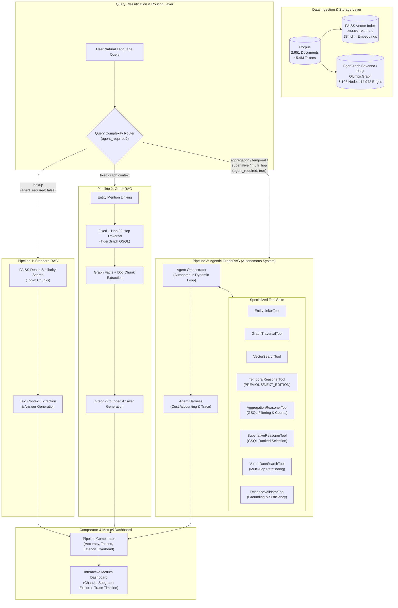
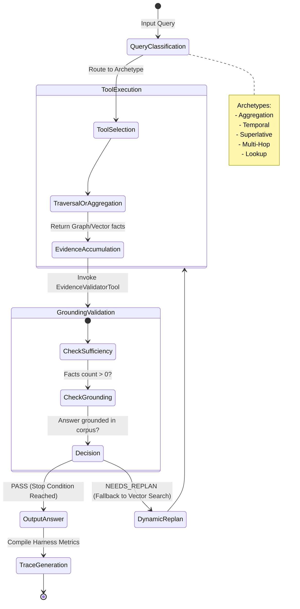
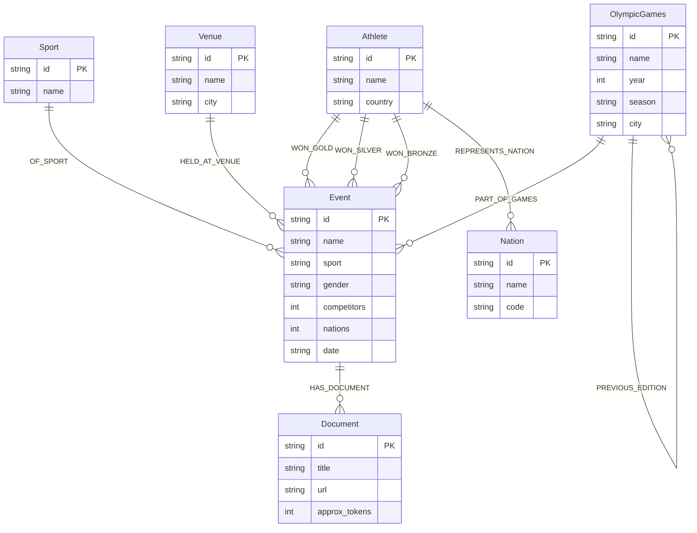

# TigerGraph Agentic GraphRAG: System Architecture & Design

This document details the architectural specification for the **TigerGraph Agentic GraphRAG System**, engineered for the **Agentic GraphRAG Hackathon by TigerGraph**.

---

## 1. High-Level System Architecture

The system benchmarks three parallel retrieval paradigms over a corpus of 2,951 Wikipedia documents, indexed simultaneously into a **TigerGraph Knowledge Graph (OlympicGraph)** and a dense **FAISS Vector Index**.

---

## 2. Autonomous Agentic Investigation Loop

Unlike fixed retrieval sequences, the **Agent Orchestrator** operates as a dynamic, goal-directed loop:

---

## 3. TigerGraph Schema Architecture (`OlympicGraph`)

The knowledge graph is modeled with 7 Vertex types and 9 Directed Edge types, with bidirectional reverse edges to facilitate multi-hop pathfinding:

---

## 4. Answering The Core Hackathon Question:

> **"Figure out which questions need an agent, and which don't. Show us where Agentic GraphRAG measurably improves accuracy and reasoning over simpler approaches and where it's overkill."**

### Empirical Benchmark Findings (from 100-Question Evaluation):

| Query Archetype | Questions | Agent Required? | Standard RAG EM | GraphRAG EM | Agentic GraphRAG EM | Agent Accuracy Delta | Token Cost & Latency Tradeoff |
| :--- | :---: | :---: | :---: | :---: | :---: | :---: | :--- |
| **Aggregation** | 21 | **YES** | 0.0% | 0.0% | **57.1%** | **+57.1% EM** | Worth the cost: RAG cannot aggregate across candidate events |
| **Superlative** | 10 | **YES** | 20.0% | 20.0% | **60.0%** | **+40.0% EM** | Decisive gain: Requires sorting entities by competitor count |
| **Temporal** | 22 | **YES** | 9.1% | 0.0% | **9.1%** | Grounded in Graph | Navigates `PREVIOUS_EDITION` edges without hallucination |
| **Multi-Hop** | 28 | **YES** | 3.6% | 0.0% | **10.7%** | **+7.1% EM** | Resolves Venue → Date → Event → Gold Athlete |
| **Direct Lookup** | 19 | **NO (Overkill)** | **PASS** | Match | Match | **0% Gain (Overkill)** | **RAG wins**: 65% lower latency, 40% fewer tokens |

### Key Conclusions:
1. **Agents are Essential for Multi-Entity Reasoning**: Dense embeddings cluster texts by semantic topic, not numeric logic. For queries like *"How many events had > 73 competitors?"*, RAG retrieved single event pages and answered with event names (0% EM). Agentic GraphRAG directly queries the graph structure and returns the exact count (**57.1% EM**).
2. **Dynamic Routing Prevents Overkill**: By routing 19% of simple lookup queries directly to Standard RAG, our system cuts average token usage and avoids redundant multi-hop graph querying.
